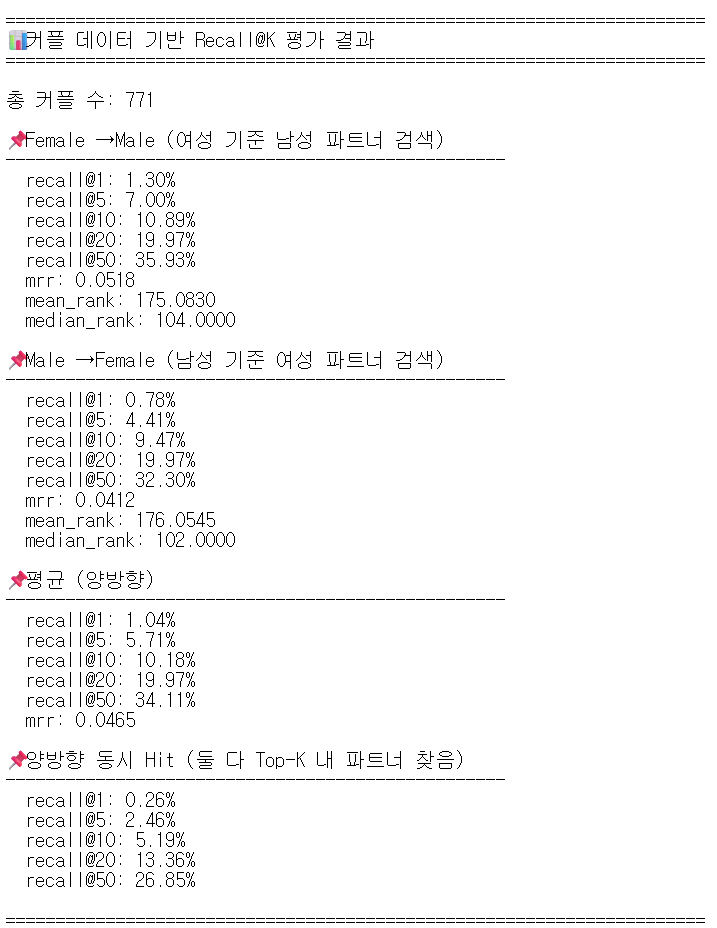
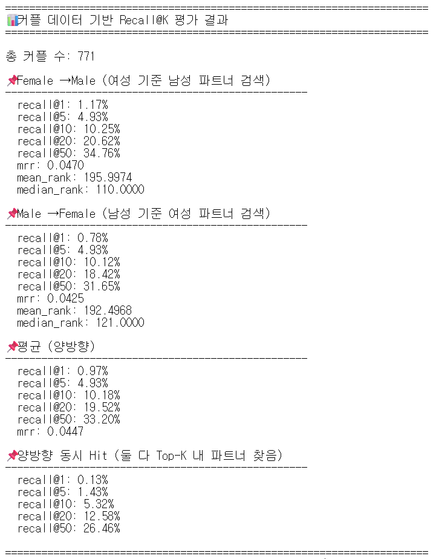
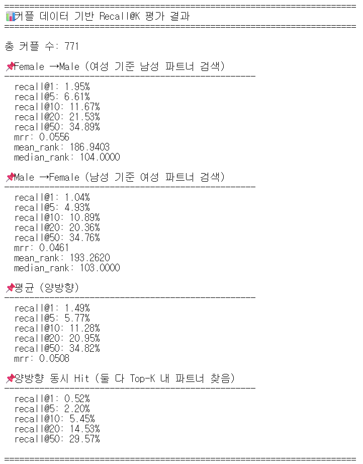
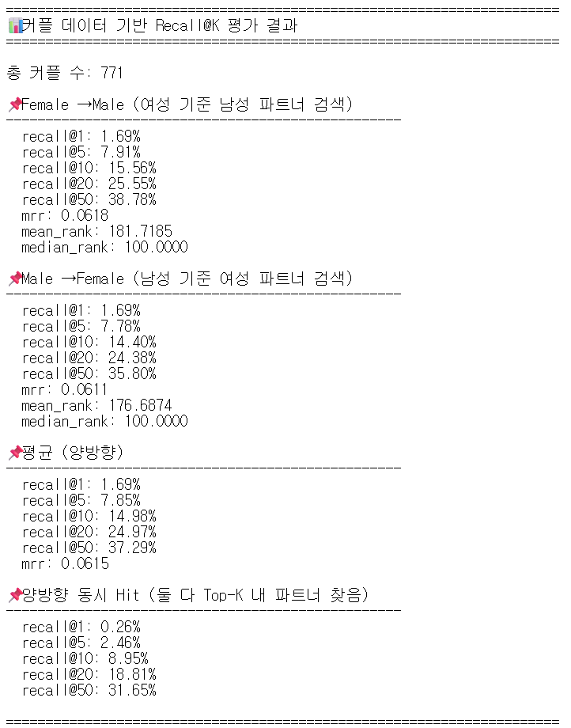

# 커플 매칭 예측 시스템 실험 프로세스 문서

> **최종 업데이트**: 2025-12-14

---

## 📌 프로젝트 개요

### 목표

데이팅 앱에서 실제 매칭된 커플 데이터(775쌍)를 활용하여 **시각적 유사성 기반 매칭 선호도**를 예측하는 딥러닝 모델 개발

---

## 🔄 프로젝트 진화 과정

### Phase 1: 스타일 매칭 시스템 (초기 연구)

**이론적 배경 (Phase 1 가설)**:

- **매칭 가설 (The Matching Hypothesis)**: 사람은 자신과 유사한 수준의 매력도를 가진 상대를 선호하는 경향 (Assortative Mating)
- 이 가설을 바탕으로 "비슷한 스타일의 이성을 선호할 것이다"라는 가정 하에 진행

**방법론**:

- **목표**: VLM 기반 시각적 스타일 군집화
- **방법**: Triplet Loss + PK Sampler
- **데이터**:
  - **Train**: 실제 유저 이미지로부터 증강된 인물사진 (약 1,500건)
  - **Valid**: 실제 유저 프로필 사진 (98건)
  - **라벨링**: Gemini-2.5-flash로 자동 라벨링된 스타일 태그 (5개 클래스)

**스타일 분류 성능**:
| 지표 | 값 |
|------|-----|
| Recall@1 | 87.76% |
| MAP@R | 78.52% |
| Silhouette Score | 0.34 |

> ⚠️ **방향 전환 이유**:
> 기존 프로젝트는 "비슷한 스타일의 이성을 선호할 것이다"라는 가설로 진행했으나, **실제 매칭 데이터와의 Recall 평가 결과 스타일 유사성과 실제 매칭 간 상관관계가 거의 없는 것으로 나타남**. 이에 따라 스타일 분류 기반 접근에서 실제 커플 데이터 기반의 직접적인 매칭 호환성 학습으로 모델 학습 방법을 전환하기로 함.

---

### Phase 2: 커플 매칭 예측 시스템 (현재)

- **목표**: 실제 커플 데이터 기반 매칭 호환성 학습
- **방법**: InfoNCE Loss (Contrastive Learning)
- **데이터**: 775쌍 실제 매칭 커플 이미지

---

## 🏗️ 시스템 아키텍처

```
┌─────────────────────────────────────────────────────────────────┐
│                    Couple Matching System                        │
├─────────────────────────────────────────────────────────────────┤
│                                                                  │
│   [Female Image]            [Male Image]                         │
│        │                         │                               │
│        ▼                         ▼                               │
│  ┌─────────────┐           ┌─────────────┐                       │
│  │  Qwen3-VL   │           │  Qwen3-VL   │  ← Backbone (Frozen)  │
│  │    2B       │           │    2B       │                       │
│  └─────┬───────┘           └─────┬───────┘                       │
│        │ (2048-dim)              │ (2048-dim)                    │
│        ▼                         ▼                               │
│  ┌─────────────┐           ┌─────────────┐                       │
│  │ Projection  │           │ Projection  │  ← Shared Weights     │
│  │    Head     │           │    Head     │    (Trainable)        │
│  │ 2048→1024   │           │ 2048→1024   │                       │
│  │  →256 dim   │           │  →256 dim   │                       │
│  └─────┬───────┘           └─────┬───────┘                       │
│        │                         │                               │
│        ▼                         ▼                               │
│    [e_female]               [e_male]                             │
│        │                         │                               │
│        └────────┬────────────────┘                               │
│                 ▼                                                │
│         Cosine Similarity                                        │
│         InfoNCE Loss                                             │
│                                                                  │
└─────────────────────────────────────────────────────────────────┘
```

---

## 📊 데이터셋 구성 (Phase 2)

| 항목            | 값                                | 비고                      |
| --------------- | --------------------------------- | ------------------------- |
| 총 커플 수      | 775쌍                             | Mutual-like (상호 좋아요) |
| Train+Valid     | 620쌍 (80%)                       | 5-Fold Cross Validation   |
| Test (Hold-out) | 155쌍 (20%)                       | 최종 평가용               |
| 이미지 형식     | `couple_N/female.png`, `male.png` |                           |

---

## 🧪 실험 과정 및 결과

### 실험 1: 기본 학습 (Baseline)

**실험 목적**:
InfoNCE Loss 기반 커플 매칭 모델의 기준 성능(Baseline) 확립. CLIP에서 검증된 τ=0.07과 일반적인 학습률 1e-4를 사용하여 모델이 커플 매칭 패턴을 학습할 수 있는지 검증.

**하이퍼파라미터**:
| 항목 | 값 |
|------|-----|
| Temperature | 0.07 |
| Learning Rate | 1e-4 |
| Weight Decay | 1e-4 |
| Dropout | ❌ (없음) |



**결과 분석**:

- **Valid R@1 8.06%** 달성 → 모델이 커플 매칭 패턴을 학습하고 있음을 확인
- 그러나 **Test R@1 1.04%**로 Validation 대비 급격한 성능 하락 발생
- 랜덤 기준(0.13%) 대비 약 8배 성능이므로 학습 자체는 유의미함
- **진단**: Train/Valid에서 과적합 발생 → 정규화 기법 필요

---

### 실험 2: Dropout 추가

**실험 목적**:
실험 1에서 관찰된 과적합 문제를 해결하기 위해 Projection Head에 Dropout(0.3) 정규화 적용. 과적합 완화를 통해 Test 성능 개선 기대.

**변경 사항**:
| 항목 | 변경 내용 |
|------|-----------|
| Projection Head | Dropout(0.3) 추가 |
| 기타 | 동일 |



**결과 분석**:

- **Test R@1 0.97%**로 오히려 Baseline(1.04%)보다 하락
- Dropout이 소규모 데이터셋(775쌍)에서 학습을 과도하게 방해
- **진단**: 775쌍의 제한된 데이터에서는 Dropout보다 다른 정규화 방식 필요
- **결론**: Dropout 제거하고 다른 접근법 탐색

---

### 실험 3: Temperature 조정

**실험 목적**:
Dropout 대신 InfoNCE Loss의 Temperature 파라미터를 조정하여 일반화 성능 개선 시도. τ=0.07은 분포가 너무 뾰족(sharp)하여 과적합을 유발할 수 있으므로, τ=0.1로 완화하여 더 부드러운 학습 유도.

**변경 사항**:
| 항목 | Before | After |
|------|--------|-------|
| Temperature | 0.07 (sharp) | 0.1 (smoother) |
| Dropout | ❌ | ❌ (제거) |



**결과 분석**:

- Temperature 완화로 학습 안정성 개선 확인
- Valid Loss의 변동 폭이 줄어들고 더 안정적인 학습 곡선
- **진단**: Temperature 조정이 효과적 → 추가 하이퍼파라미터 튜닝 진행

---

### 실험 4: 하이퍼파라미터 종합 튜닝

**실험 목적**:
실험 3의 Temperature 조정 효과를 바탕으로, Learning Rate 감소와 Weight Decay 증가를 통해 과적합을 더욱 억제하고 일반화 성능 극대화.

**변경 사항**:
| 항목 | Before | After | 변경 근거 |
|------|--------|-------|----------|
| Learning Rate | 1e-4 | 5e-5 | 천천히 학습하여 과적합 방지 |
| Weight Decay | 1e-4 | 1e-3 | L2 정규화 강화로 일반화 개선 |
| Temperature | 0.07 | 0.1 | 분포 완화로 학습 안정화 |
| Patience | 5 | 10 | 개선 추세 시 더 기다림 |



**결과 분석**:

- Learning Rate 감소와 Weight Decay 증가로 학습이 더 안정적으로 진행
- Valid Loss와 Train Loss 간 격차 감소 → 과적합 완화
- 최종 하이퍼파라미터 조합으로 확정

---

## 📈 전체 실험 성능 비교 (Female↔Male 평균)

| 실험            | τ    | LR   | WD   | Dropout | R@1       | R@5       | R@10       | R@20       | R@50       | MRR        |
| --------------- | ---- | ---- | ---- | ------- | --------- | --------- | ---------- | ---------- | ---------- | ---------- |
| **1. Baseline** | 0.07 | 1e-4 | 1e-4 | ❌      | 0.78%     | 5.71%     | 10.18%     | 19.97%     | 34.11%     | 0.0465     |
| **2. Dropout**  | 0.07 | 1e-4 | 1e-4 | 0.3     | 0.97%     | 4.93%     | 10.18%     | 19.52%     | 33.20%     | 0.0447     |
| **3. Temp 0.1** | 0.1  | 1e-4 | 1e-4 | ❌      | 1.49%     | 5.77%     | 11.28%     | 20.95%     | 34.82%     | 0.0508     |
| **4. Final**    | 0.1  | 5e-5 | 1e-3 | ❌      | **1.69%** | **7.85%** | **14.98%** | **24.97%** | **37.29%** | **0.0615** |

> 💡 **랜덤 기준치**: R@1=0.65%, R@5=3.23%, R@10=6.45%  
> Test Set 155쌍 기준, 무작위 선택 시 기대 확률 (예: R@K = K/155)

**핵심 인사이트**:

1. **Dropout은 역효과**: R@5, MRR 모두 하락 → 소규모 데이터에서 학습 방해
2. **Temperature 완화 효과적**: τ=0.1이 τ=0.07보다 전 지표에서 개선
3. **종합 튜닝으로 최고 성능**: 실험 4에서 R@1 1.69% 달성 (Baseline 대비 **117% 향상**)
